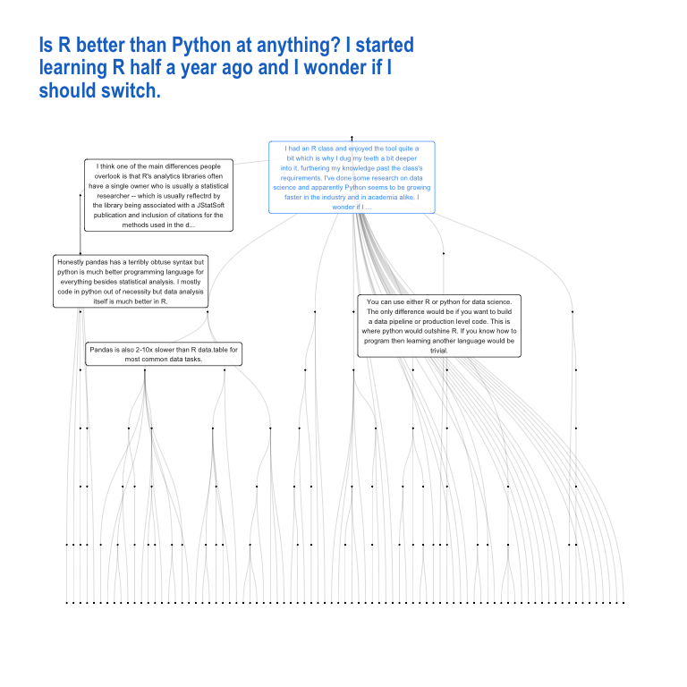
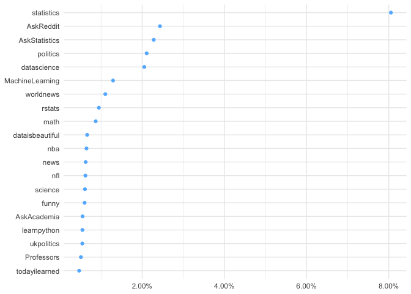
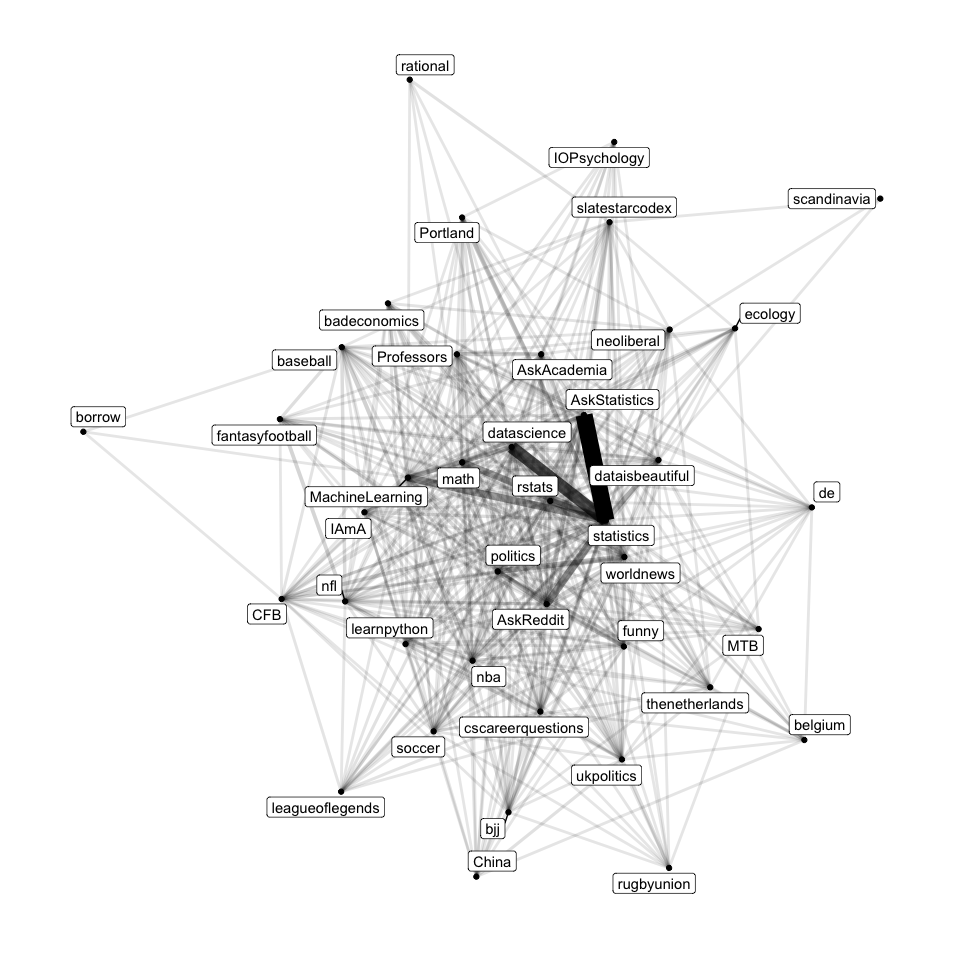
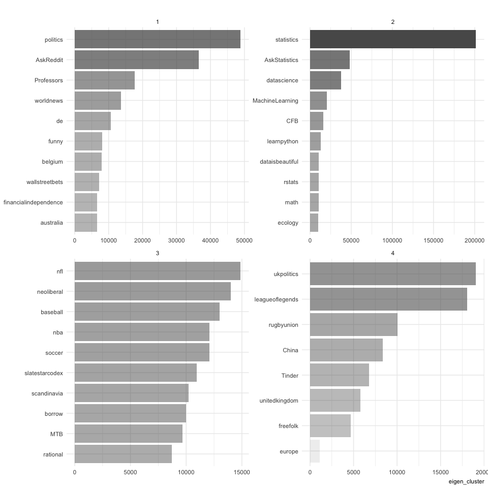
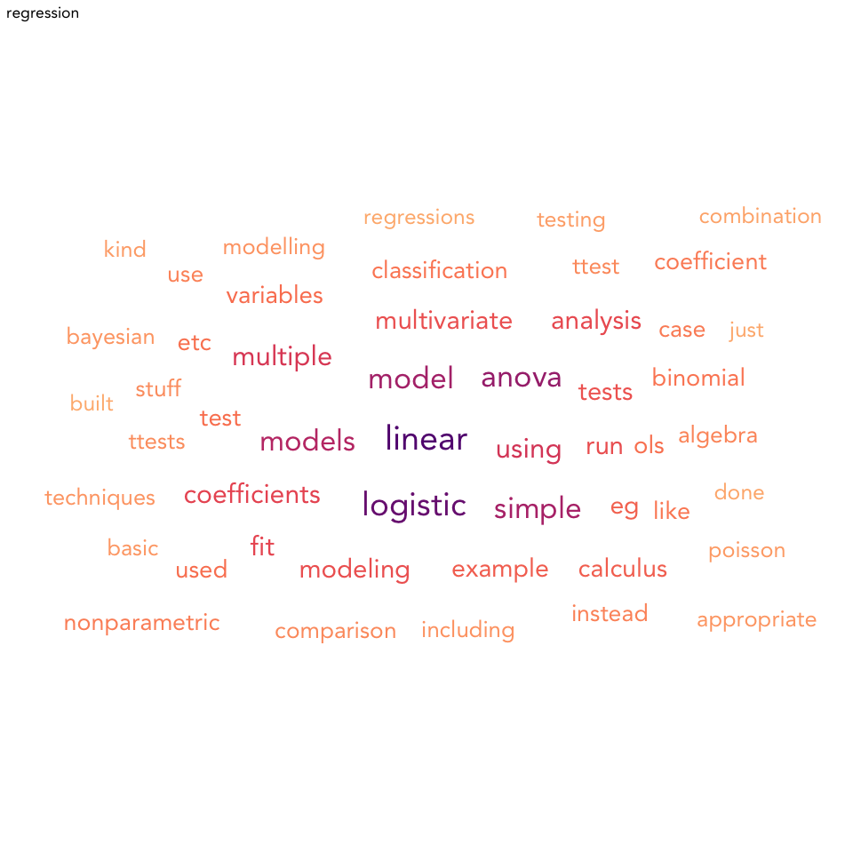

I created this repository in order to as a way to work with Reddit
conversations using the Python Reddit API Wrapper
([PRAW](https://praw.readthedocs.io/en/latest/))

In the future, I’ll turn this into a package called rraw or rwar. But
first I need to learn more about the R’s encapsulated object-oriented
programming system ([R6](https://r6.r-lib.org/)).

It also contains scripts for analyzing this data, and a couple of case
studies.

    .
    ├── README.Rmd
    ├── README.html
    ├── README.md
    ├── aff_net.rds
    ├── redditAnalysis
    │   ├── README.md
    │   ├── net_plot.png
    │   ├── net_reddit.R
    │   ├── netproj_reddit.R
    │   └── w2v_reddit.R
    ├── redditAnalysis.Rproj
    ├── redditData
    │   ├── Python
    │   │   ├── authenticateAPI.py
    │   │   ├── get_threads.py
    │   │   ├── get_threads_by_keyword.py
    │   │   └── search_keywords.py
    │   ├── R
    │   │   ├── affiliationNetwork.R
    │   │   ├── downloadURLs.R
    │   │   └── getThread.R
    │   └── README.md
    ├── secretInfo.R
    └── stats.rds

Proof of Concept
----------------

***Getting the data***

Using the functions in `redditData/`, we download the latest 1000
threads from [/r/statistics](https://www.reddit.com/r/statistics/) using
the functions in `downloadURLs.R`.

> This is a subreddit for discussion on all things dealing with
> statistical theory, software, and application. We welcome all
> researchers, students, professionals, and enthusiasts looking to be a
> part of an online statistics community.

    source("redditData/R/downloadURLs.R")
    stats <- downloadSubredditURLs("statistics")

We can download each individual thread using the functions in
`getThread.R`. The output looks something like this:

    source("redditData/R/getThread.R")
    output <- vector("list", nrow(stats))

    for (i in seq_along(output)) {
      output[[i]] <- try(extractThread(stats$link[[i]]))
    }

    stats$node_data <- map(output, pluck, 1)
    stats$edge_list <- map(output, pluck, 2)

This is how the dataset looks like:

    glimpse(stats)

    Observations: 999
    Variables: 8
    $ title        <chr> "The trump problem", "Bing results. Where stats and…
    $ post_score   <int> 468, 300, 292, 281, 278, 263, 260, 251, 248, 242, 2…
    $ num_comments <int> 34, 4, 15, 40, 27, 87, 6, 37, 36, 9, 25, 11, 43, 67…
    $ date         <dttm> 2017-12-02 11:05:41, 2017-11-17 23:00:54, 2017-02-…
    $ link         <chr> "/r/statistics/comments/7h23he/the_trump_problem/",…
    $ subreddit    <chr> "statistics", "statistics", "statistics", "statisti…
    $ node_data    <list> [<tbl_df[36 x 11]>, <tbl_df[6 x 11]>, <tbl_df[16 x…
    $ edge_list    <list> [<tbl_df[35 x 2]>, <tbl_df[5 x 2]>, <tbl_df[16 x 2…

    glimpse(stats$node_data[[1]])

    Observations: 36
    Variables: 11
    $ name        <chr> "7h23he", "dqnj0sx", "dqniij0", "dqnmg37", "dqnzy28"…
    $ author      <chr> "lamhrp2", "HejAnton", "ErnestoRM", "PostmdnLifeIsRu…
    $ score       <int> NA, 43, 18, 17, 8, 6, 2, 1, 1, 0, 12, 38, 13, 7, 14,…
    $ text        <chr> "", "The Abracadabra Martingale! My probability prof…
    $ children    <int> 9, 1, 1, 2, 0, 1, 2, 0, 1, 0, 1, 1, 0, 0, 1, 1, 1, 0…
    $ descendents <int> 35, 3, 8, 2, 0, 4, 8, 0, 1, 0, 2, 7, 0, 0, 3, 2, 4, …
    $ date        <dttm> 2017-12-02 11:05:41, 2017-12-02 11:35:32, 2017-12-0…
    $ title       <chr> "The trump problem", "The trump problem", "The trump…
    $ media       <chr> "https://i.redd.it/kqnvc5wcrh101.jpg", NA, NA, NA, N…
    $ subreddit   <chr> "statistics", "statistics", "statistics", "statistic…
    $ path        <chr> "/r/statistics/comments/7h23he/the_trump_problem/", …

    glimpse(stats$edge_list[[1]])

    Observations: 35
    Variables: 2
    $ from <chr> "7h23he", "7h23he", "7h23he", "7h23he", "7h23he", "7h23he",…
    $ to   <chr> "dqnj0sx", "dqniij0", "dqnmg37", "dqnzy28", "dqnknf6", "dqn…

Finally, we can then build an bipartite graph between users and
subreddits using `affiliationNetwork.R`. To do this, we extract a list
of unique users.

    user_df <- stats %>% 
      filter(num_comments > 0) %>%  ## remove empty threads
      pull(node_data) %>% 
      bind_rows() %>% 
      count(author) %>% 
      filter(n > 5, author != "[deleted]") ## remove sparse users

    glimpse(user_df)

    Observations: 858
    Variables: 2
    $ author <chr> "__compactsupport__", "_Zer0_Cool_", "-2log_likelihood", …
    $ n      <int> 93, 8, 11, 7, 6, 8, 7, 26, 29, 6, 6, 7, 9, 6, 8, 70, 9, 1…

And then create the affiliation network:

    aff_net <- create_affiliation_network(user_df$author)
    error_index <- map_lgl(aff_net, get_error_index)
    aff_net <- aff_net[!error_index]

***Analyzing the data***

1.  Visualizing individual threads

<!-- -->

    source("redditAnalysis/net_reddit.R")

    stats_subset <- stats %>% 
      filter(str_detect(title, "Is R better than Python at anything?")) %>% 
      mutate(graph = map2(node_data, edge_list, net_grow_tree))

    Warning in if (class(newval) == "factor") {: the condition has length > 1
    and only the first element will be used

    library(ggraph)
    net_plot(stats_subset$graph[[1]], stats_subset$title[[1]], style = 3)

1.  Clustering the bipartite graph

<!-- -->

    source("redditAnalysis/netproj_reddit.R")

    aff_df <- netproj_create_edgelist(aff_net)

    851 unique users

    5216 unique subreddits

    glimpse(aff_df)

    Observations: 82,912
    Variables: 2
    $ author    <chr> "__compactsupport__", "__compactsupport__", "__compact…
    $ subreddit <chr> "uwo", "statistics", "statistics", "statistics", "stat…

    aff_df %>% 
      count(subreddit) %>%
      mutate(prop = n / sum(n)) %>%
      arrange(desc(n)) %>%
      top_n(20) %>%
      ggplot(aes(x = fct_reorder(subreddit, prop), y = prop)) +
      geom_point(color = "steelblue1") +
      coord_flip() +
      labs(x = NULL, y = NULL) +
      scale_y_continuous(labels = scales::percent)

    Selecting by prop

    M <- netproj_subreddit_adj_mat(aff_df, min_n = 100)

    Loading required package: Matrix

    Attaching package: 'Matrix'

    The following objects are masked from 'package:tidyr':

        expand, pack, unpack

    Original matrix dimensions: 844 x 111

    Projected matrix dimensions: 111 x 111

    Sparsity 93.5%

    netproj_plot_n(M, N = 40)

    Using `stress` as default layout

    clusters <- netproj_cluster(M)

    Finding community structure by multi-level optimization of modularity: igraph::louvain_cluster

    Community structure via greedy optimization of modularity: igraph::cluster_fast_greedy

    Community strucure via short random walks: igraph::cluster_walktrap

    Community structure detecting based on the leading eigenvector of the community matrix: igraph::cluster_leading_eigen

    Finding communities in graphs based on statistical mechanics: igraph::cluster_spinglass

    netproj_plot_communities(clusters, "eigen_cluster", N = 10, ncol = 2)

1.  Word embeddings

<!-- -->

    source("redditAnalysis/w2v_reddit.R")

    Loading required package: NLP

    Attaching package: 'NLP'

    The following object is masked from 'package:ggplot2':

        annotate

    stats_processed <- w2v_preprocess(stats)
    word_vectors <- w2v_fit(stats_processed)

    Fitting word2vec...
    INFO [2019-10-20 17:51:11] 2019-10-20 17:51:11 - epoch 1, expected cost 0.1015
    INFO [2019-10-20 17:51:12] 2019-10-20 17:51:12 - epoch 2, expected cost 0.0530
    INFO [2019-10-20 17:51:13] 2019-10-20 17:51:13 - epoch 3, expected cost 0.0445
    INFO [2019-10-20 17:51:14] 2019-10-20 17:51:14 - epoch 4, expected cost 0.0396
    INFO [2019-10-20 17:51:14] 2019-10-20 17:51:14 - epoch 5, expected cost 0.0363
    INFO [2019-10-20 17:51:15] 2019-10-20 17:51:15 - epoch 6, expected cost 0.0338
    INFO [2019-10-20 17:51:16] 2019-10-20 17:51:16 - epoch 7, expected cost 0.0319
    INFO [2019-10-20 17:51:17] 2019-10-20 17:51:17 - epoch 8, expected cost 0.0304
    INFO [2019-10-20 17:51:18] 2019-10-20 17:51:18 - epoch 9, expected cost 0.0291
    INFO [2019-10-20 17:51:18] 2019-10-20 17:51:18 - epoch 10, expected cost 0.0280
    INFO [2019-10-20 17:51:19] 2019-10-20 17:51:19 - epoch 11, expected cost 0.0271
    INFO [2019-10-20 17:51:20] 2019-10-20 17:51:20 - epoch 12, expected cost 0.0263
    INFO [2019-10-20 17:51:20] 2019-10-20 17:51:20 - epoch 13, expected cost 0.0256
    INFO [2019-10-20 17:51:21] 2019-10-20 17:51:21 - epoch 14, expected cost 0.0249
    INFO [2019-10-20 17:51:22] 2019-10-20 17:51:22 - epoch 15, expected cost 0.0244
    INFO [2019-10-20 17:51:22] 2019-10-20 17:51:22 - epoch 16, expected cost 0.0239
    INFO [2019-10-20 17:51:23] 2019-10-20 17:51:23 - epoch 17, expected cost 0.0234
    INFO [2019-10-20 17:51:24] 2019-10-20 17:51:24 - epoch 18, expected cost 0.0230
    INFO [2019-10-20 17:51:24] 2019-10-20 17:51:24 - epoch 19, expected cost 0.0227
    INFO [2019-10-20 17:51:25] 2019-10-20 17:51:25 - epoch 20, expected cost 0.0223
    INFO [2019-10-20 17:51:26] 2019-10-20 17:51:26 - epoch 21, expected cost 0.0220
    INFO [2019-10-20 17:51:27] 2019-10-20 17:51:27 - epoch 22, expected cost 0.0217
    INFO [2019-10-20 17:51:27] 2019-10-20 17:51:27 - epoch 23, expected cost 0.0214
    INFO [2019-10-20 17:51:28] 2019-10-20 17:51:28 - epoch 24, expected cost 0.0212
    INFO [2019-10-20 17:51:29] 2019-10-20 17:51:29 - epoch 25, expected cost 0.0209
    INFO [2019-10-20 17:51:30] 2019-10-20 17:51:30 - epoch 26, expected cost 0.0207
    INFO [2019-10-20 17:51:31] 2019-10-20 17:51:31 - epoch 27, expected cost 0.0205
    INFO [2019-10-20 17:51:31] 2019-10-20 17:51:31 - epoch 28, expected cost 0.0203
    INFO [2019-10-20 17:51:32] 2019-10-20 17:51:32 - epoch 29, expected cost 0.0201
    INFO [2019-10-20 17:51:33] 2019-10-20 17:51:33 - epoch 30, expected cost 0.0200

    word_vectors %>% 
      w2v_cosine_similarity("r")

    # A tibble: 3,184 x 2
       word         r
       <chr>    <dbl>
     1 r        1.000
     2 python   0.851
     3 sas      0.742
     4 use      0.629
     5 code     0.616
     6 learn    0.608
     7 spss     0.590
     8 learning 0.577
     9 language 0.574
    10 using    0.559
    # … with 3,174 more rows

    word_vectors %>% 
      w2v_cosine_similarity("bayesian")

    # A tibble: 3,184 x 2
       word        bayesian
       <chr>          <dbl>
     1 bayesian       1.   
     2 frequentist    0.782
     3 inference      0.622
     4 approach       0.617
     5 methods        0.595
     6 statistics     0.552
     7 using          0.509
     8 probability    0.475
     9 think          0.470
    10 models         0.459
    # … with 3,174 more rows

    word_vectors %>% 
      w2v_wordcloud(x = "regression")

    Loading required package: ggwordcloud

    Selecting by regression

***To do***

-   Move the creation of word embeddings from the text2vec package to
    keras.

-   Doing clustering on individual users too

-   Improving the individual thread visualizations with JavaScript
