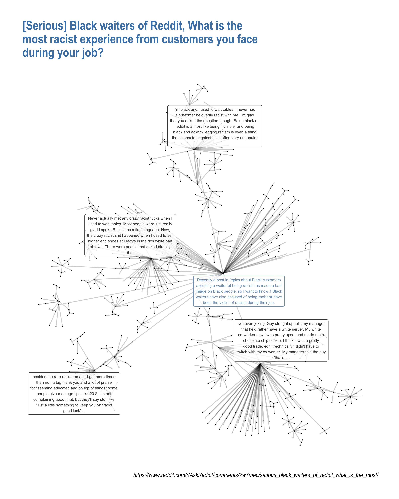

The functions collected here start with prefix that's supposed to be indicative of the types of analysis we do.

- `w2v_`: functions for fitting and analyzing word2vec models around Reddit conversations.

- `net_`: functions for analyzing with the network structure of reddit conversations.

    For example, this is one output of `net_plot()`

    